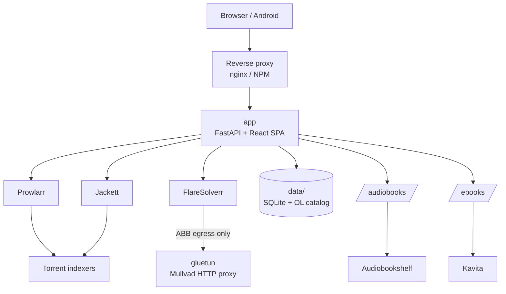

# Library

Self-hosted audiobook and ebook library with catalog browsing, torrent discovery, debrid downloads, and in-app listening/reading.

Search books across Google Books, Open Library, Hardcover, NYT, and ISBNdb. Find releases through a local indexer cache (AudioBook Bay, Knaben, Prowlarr/Jackett). Download via Real-Debrid and/or TorBox (or Anna's Archive for ebooks). Files land in your Audiobookshelf and Kavita libraries. Listen and read in the web app or Android client with progress sync, offline cache, and live status.

**Repository:** [github.com/brutaliccus/Library](https://github.com/brutaliccus/Library)

---

## Features

### Catalog & discovery
- Book search and detail pages with covers, descriptions, ratings, and series
- Metadata from Google Books, a local Open Library catalog database, Hardcover, NYT bestsellers, and ISBNdb
- Home shelves: curated lists, trending, new releases (daily snapshots persist across restarts)
- Genre hubs and series drill-down pages
- Availability badges: in your library, in the indexer cache, and/or cached on debrid

### Search & indexer cache
- Cache-first search against a local torrent index (fast, no indexer hammering)
- **Shipped warm cache** (~36 MB compressed seed) imported automatically on first boot so new installs are useful immediately
- Live Prowlarr search when you need fresher results (SSE live-stream)
- AudioBook Bay integration (RSS ingest + Jackett live search)
- Knaben RSS ingest (optional full crawl)
- Anna's Archive ebook search and download (optional membership cookie)
- Background scraper matches releases to catalog volumes and refreshes debrid "cached" badges

### Downloads & debrid
- One-click requests through Real-Debrid and/or TorBox
- Server-wide defaults plus per-library-group API keys
- Magnet -> debrid -> organized `Author/Title` folders -> library scan
- Smart-stream from debrid without waiting for a full library ingest
- Download pipeline with WebSocket progress on the Requests page

### Libraries
- Audiobookshelf: browse, play (proxied stream), progress sync, scan trigger
- Kavita: ebook collections, covers, PDF/EPUB reader endpoints
- Shared on-disk media across library groups; debrid credentials are group-scoped

### Listening & reading
- Full audiobook player with mini-player, scrubbing, and media session controls
- In-app ebook reader (PDF + EPUB) with reading progress
- Offline audio cache and offline playback helpers (web + Android WebView)
- Continue listening / continue reading on the home screen

### Accounts & library groups
- JWT auth; first account becomes admin
- Account request -> admin approve/deny -> temporary password -> forced password change
- Library groups with invite codes (owner / admin / member roles)
- Per-user preferred debrid provider and private mode

### Admin
- First-run setup wizard at `/admin/setup` (libraries, Prowlarr, debrid, catalog APIs, scraper mode)
- **Config** tab: edit runtime settings and API keys (DB override with env fallback)
- **Cache** tab: scraper enable/run, RSS vs deep-crawl tuning, debrid refresh, catalog relink
- User approvals, download monitoring, and integration health probes
- RSS-only scraper defaults (Pi-friendly); optional high-usage FlareSolverr crawls

### Notifications
- Web Push (VAPID) for download completion and admin events
- Availability alerts: watch a book that isn't in cache yet; get notified when it appears
- Real-time WebSocket updates for active downloads
- Native notifications on the Android app

### Android app
- Capacitor shell loading your hosted `APP_URL` (deploys update the app without rebuilding)
- Lock-screen / notification media controls
- Android Auto: Continue Listening and A-Z library browse  
  See [docs/android-app.md](docs/android-app.md)

### Optional networking
- Mullvad WireGuard via gluetun - HTTP proxy used **only** for AudioBook Bay egress
- Jackett, Knaben, and the rest of the stack stay on the LAN
- Register WireGuard from Admin (or `scripts/mullvad_register_wg.py`)
- Example nginx and Nginx Proxy Manager configs in `nginx/`
- Optional Tailscale Funnel exposure: [docs/TAILSCALE_FUNNEL.md](docs/TAILSCALE_FUNNEL.md)

---

## Architecture



### Request paths

| Flow | What happens |
|------|----------------|
| **Catalog browse** | SPA -> `/api/books/*` -> Google Books / Open Library DB / Hardcover / NYT / ISBNdb |
| **Release search** | SPA -> `/api/search` -> local indexer cache first; optional live Prowlarr / Jackett ABB / AA |
| **Download** | SPA -> `/api/requests` -> Real-Debrid or TorBox -> files under `/audiobooks` or `/ebooks` -> ABS/Kavita scan -> WebSocket + push |
| **Scraper** | Background job (ABB/Knaben RSS by default) -> indexer cache -> catalog match -> debrid preload badges |
| **Listen** | SPA -> `/api/stream/*` -> ABS proxy or debrid smart-stream; progress sync |
| **Read** | SPA -> `/api/library/reader/*` -> Kavita chapters / PDF; in-app `PdfViewer` / EPUB reader |

### Stack

| Layer | Tech |
|-------|------|
| Backend | Python 3.11, FastAPI, SQLAlchemy (async), SQLite, Alembic |
| Frontend | React, Vite, Tailwind CSS, TanStack Query, pdf.js |
| Mobile | Capacitor Android (+ Android Auto MediaBrowserService) |
| Infra | Docker Compose, optional nginx / Tailscale |
| Integrations | Prowlarr, Jackett, FlareSolverr, Real-Debrid, TorBox, Audiobookshelf, Kavita, Mullvad/gluetun |

### Docker services

| Service | Role |
|---------|------|
| **app** | API + SPA; scraper; download pipeline |
| **prowlarr** | Indexer manager |
| **jackett** | Indexer bridge (including AudioBook Bay) |
| **flaresolverr** | Cloudflare challenge solver for ABB / AA paths |
| **gluetun** | Mullvad WireGuard HTTP proxy for ABB egress only |

---

## Prerequisites

- Docker Engine + Docker Compose plugin
- A Real-Debrid and/or TorBox account
- Audiobookshelf and/or Kavita reachable from the host
- A public HTTPS hostname (or Tailscale Funnel) if you want off-LAN access and push/Android

---

## Quick start

### Install script

```bash
git clone https://github.com/brutaliccus/Library.git library
cd library
chmod +x scripts/install_library.sh
./scripts/install_library.sh /opt/library
```

Or run the installer against a fresh target; it clones from this repo by default:

```bash
curl -fsSL https://raw.githubusercontent.com/brutaliccus/Library/main/scripts/install_library.sh | bash
```

The script writes `.env`, creates media directories, applies **RSS-only** scraper defaults (unless you opt into deep crawls), builds the stack, waits for health, and can install a nightly DB backup cron.

### Manual

```bash
git clone https://github.com/brutaliccus/Library.git library
cd library
cp .env.example .env
# Edit APP_URL, SECRET_KEY, media paths, and any API keys you already have
mkdir -p media/audiobooks media/ebooks media/openlibrary data
docker compose up -d --build
```

The image **builds the frontend in Docker** - you do not need Node on the host for production.

App listens on **`http://127.0.0.1:8085`**.

### First-run wizard

1. Open the site -> create the **admin** account  
2. Go to **`/admin/setup`** - libraries (ABS/Kavita), Prowlarr, debrid defaults, catalog API keys, scraper mode  
3. Create or join a **library group** at `/onboarding` (group debrid keys)  
4. Anytime later: **Admin -> Config** and **Admin -> Cache**

### Media mounts

Compose reads host paths from `.env`:

| Variable | Default | Container path |
|----------|---------|----------------|
| `AUDIOBOOK_HOST_DIR` | `./media/audiobooks` | `/audiobooks` |
| `EBOOK_HOST_DIR` | `./media/ebooks` | `/ebooks` |
| `OPENLIBRARY_HOST_DIR` | `./media/openlibrary` | `/openlibrary` |

Point these at existing library folders if you already have them. In-container paths used by the app are `AUDIOBOOK_DIR=/audiobooks` and `EBOOK_DIR=/ebooks`.

### Reverse proxy

Example configs:

- `nginx/library.example.com.conf` - full site proxy (long timeouts for search streams + WebSockets)
- `nginx/npm-server_proxy.conf` - Nginx Proxy Manager custom locations

Proxy to `http://127.0.0.1:8085`.

---

## Configuration

See [`.env.example`](.env.example) for the full list.

Most integration keys can also be set in **Admin -> Config** (stored in the DB, env as fallback). `SECRET_KEY`, VAPID private key, and storage paths stay env-only.

| Area | Variables |
|------|-----------|
| Core | `SECRET_KEY`, `DATABASE_URL`, `APP_URL` |
| Indexers | `PROWLARR_URL`, `PROWLARR_API_KEY`, `JACKETT_*`, `FLARESOLVERR_URL` |
| Scraper | `ABB_RSS_ONLY`, `ABB_AUTHOR_CRAWL_ENABLED`, `ABB_LIVE_SEARCH_ENABLED`, Knaben crawl knobs |
| Debrid | `REAL_DEBRID_API_TOKEN`, `TORBOX_API_TOKEN` |
| Libraries | `ABS_URL`, `ABS_API_KEY`, `ABS_LIBRARY_ID`, `KAVITA_*` |
| Catalog | `HARDCOVER_API_KEY`, `NYT_API_KEY`, `ISBNDB_API_KEY`, `GOOGLE_BOOKS_API_KEY`, `AA_ACCOUNT_ID` |
| VPN | `WIREGUARD_PRIVATE_KEY`, `WIREGUARD_ADDRESSES`, `MULLVAD_*`, `ABB_PROXY_URL` |
| Push | `VAPID_PUBLIC_KEY`, `VAPID_PRIVATE_KEY` (`python scripts/generate_vapid.py`) |
| Host mounts | `AUDIOBOOK_HOST_DIR`, `EBOOK_HOST_DIR`, `OPENLIBRARY_HOST_DIR`, `PUID`, `PGID`, `TZ` |

### Scraper modes

| Mode | Behavior |
|------|----------|
| **RSS-only (default)** | ABB + Knaben RSS ingest; live Jackett ABB search still works; low CPU |
| **Deep crawl (optional)** | ABB author/A-Z Flare crawls, ABB live Flare deep search, Knaben full category crawl - high usage on a Pi |

Prefer RSS-only unless you know you need the deeper coverage.

### Open Library catalog (optional)

A local SQLite catalog avoids hammering live Open Library APIs during scrape/match. It is **not** required for a working install (the indexer cache seed is enough to search releases).

**Admin → Config → Storage (or Catalog)** has a **Generate catalog** button with size/time warnings. That runs the same import as:

```bash
python scripts/ol_import_dumps.py --help
# Monthly refresh cron (optional):
bash scripts/install_ol_catalog_cron.sh
```

Expect multi-GB downloads and a multi-GB finished DB (much larger if you include editions). On a Pi this often takes many hours. Mount dump/working dirs via `OPENLIBRARY_HOST_DIR`.

---

## Operations

### Database & backups

- SQLite DB: `data/app.db` (users, indexer cache, progress, settings, alerts)
- Alembic migrations run automatically on startup
- Nightly backup cron: `bash scripts/install_backup_cron.sh` -> `data/backups/`

### Useful scripts

| Script | Purpose |
|--------|---------|
| `scripts/install_library.sh` | Full host bootstrap |
| `scripts/generate_vapid.py` | Web Push keypair |
| `scripts/backup_db.sh` / `install_backup_cron.sh` | DB backups |
| `scripts/sync_jackett_env.sh` | Copy Jackett API key into `.env` |
| `scripts/sync_prowlarr_abb_indexer.sh` | Wire Prowlarr -> Jackett ABB |
| `scripts/mullvad_register_wg.py` | Register Mullvad WireGuard keys |
| `scripts/ol_import_dumps.py` / `refresh_ol_catalog.sh` | Open Library catalog |
| `scripts/check.ps1` | Pre-deploy tests + typecheck (dev) |

### Health

**Admin -> Health** probes Real-Debrid, TorBox, Audiobookshelf, Kavita, Prowlarr, Jackett, FlareSolverr, Mullvad, Knaben, Open Library catalog, NYT, and disk space.

---

## Development

### Backend

```bash
python -m venv .venv
source .venv/bin/activate   # Windows: .venv\Scripts\activate
pip install -r requirements.txt
uvicorn app.main:app --reload --port 8080
```

### Frontend

```bash
cd frontend
npm install
npm run dev
```

Vite proxies `/api` and `/ws` to `localhost:8080`.

### Production frontend build (local)

```bash
cd frontend
npm run build   # -> backend/static/
```

Docker production builds use a multi-stage image and do not require this step on the host.

### Checks

```powershell
.\scripts\check.ps1 -SkipAndroid
```

### Android

Point `frontend/capacitor.config.ts` `server.url` at your HTTPS `APP_URL`, then:

```bash
cd frontend
npm run android:sync
npm run android:open
```

Details: [docs/android-app.md](docs/android-app.md).

---

## Project layout

```
app/                 FastAPI application (routers, services, models)
frontend/            React SPA + Capacitor Android project
migrations/          Alembic schema versions
seed/                Warm indexer-cache DB (gzipped; auto-imported on first boot)
nginx/               Reverse-proxy examples
scripts/             Install, backup, catalog, indexer helpers
tests/               Pytest suite
docker-compose.yml   App + Prowlarr + Jackett + FlareSolverr + gluetun
Dockerfile           Multi-stage: Node frontend build -> Python app image
.env.example         Documented environment template
```

---

## License

Use and modify for your own self-hosted deployment. Respect the terms of third-party services you connect (debrid providers, indexers, catalog APIs, library apps).
