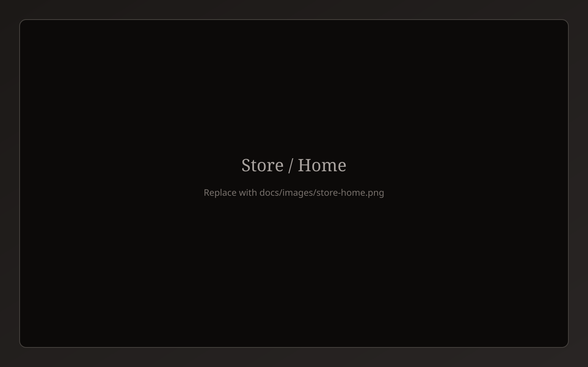
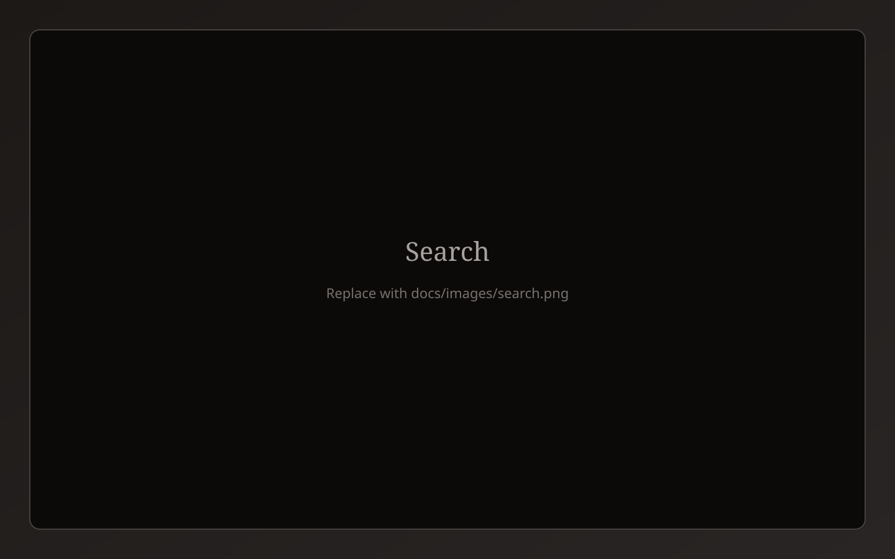
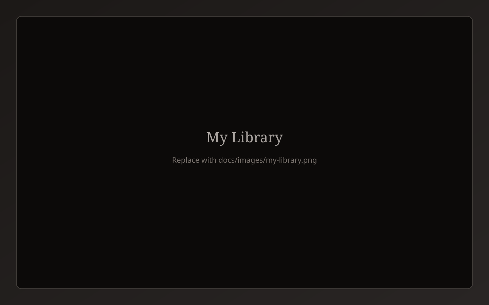
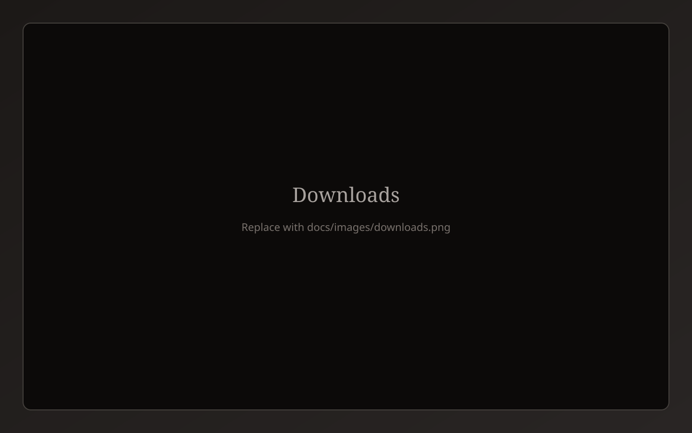
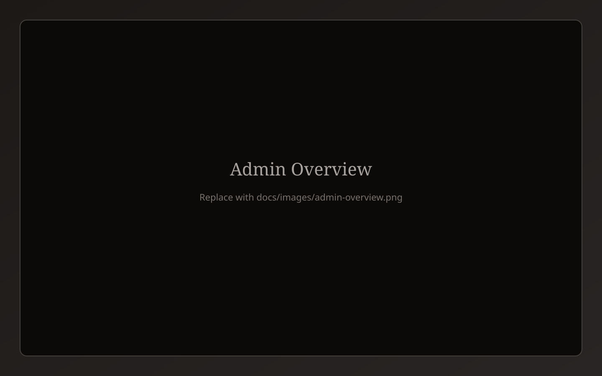
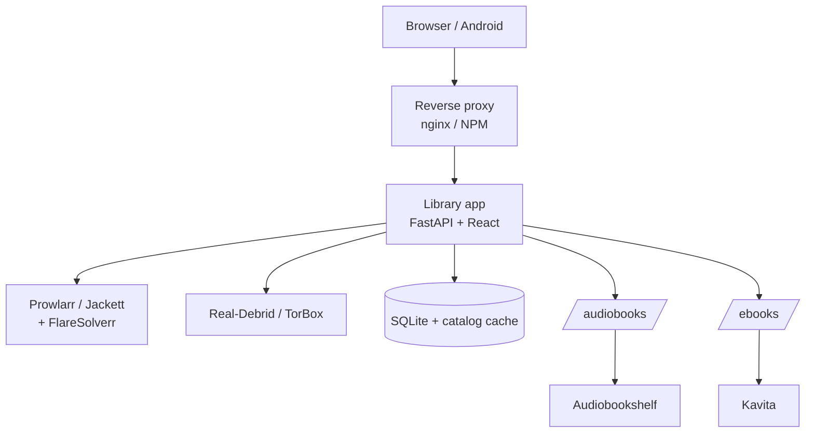

# Library

**Self-hosted audiobook and ebook library** — browse a catalog, find releases, download through debrid, then listen and read in the same app.

Search books across Google Books, Open Library, Hardcover, NYT, and ISBNdb. Discover torrents from a local indexer cache (AudioBook Bay, Knaben, Prowlarr/Jackett). Send downloads through Real-Debrid and/or TorBox (or Anna’s Archive for ebooks). Files land in **Audiobookshelf** and **Kavita**. Keep listening and reading in the web UI or Android app with progress sync, offline cache, and live status.

**Repository:** [github.com/brutaliccus/Library](https://github.com/brutaliccus/Library)

---

## Who it’s for

- Self-hosters who want one place to **discover → request → organize → enjoy** audiobooks and ebooks
- Households or small friend groups sharing a private library via invite links
- People already running (or happy to run) Docker, with optional Audiobookshelf / Kavita / debrid accounts
- Raspberry Pi and small-server hosts who prefer RSS-first indexer defaults over heavy crawls

---

## Screenshots

Placeholders until you capture from your own instance — see [Capturing screenshots](#capturing-screenshots).

| Store / home | Search |
|:---:|:---:|
|  |  |

| My Library | Book detail |
|:---:|:---:|
|  |  |

| Downloads | Admin overview |
|:---:|:---:|
|  |  |

After running the capture script, replace the `.svg` files above with the matching `.png` names in `docs/images/` (or update these links).

---

## Features

### Store & discovery
- Home shelves: curated lists, trending, new releases
- Book detail with covers, descriptions, ratings, and series
- Genre hubs and series drill-down
- Availability badges: in your library, in the indexer cache, and/or cached on debrid
- Optional magnet → request browser extension — [browser-extension/README.md](browser-extension/README.md)

### Search & indexers
- Cache-first torrent search (fast, indexer-friendly)
- Warm indexer cache on first boot (~36 MB compressed) so cached books appear immediately
- Live Prowlarr search when you want fresher results
- AudioBook Bay (RSS + Jackett live search) and Knaben RSS
- Optional Anna’s Archive ebook search

### Downloads & debrid
- One-click requests via Real-Debrid and/or TorBox
- Smart provider pick when a title is cached on one network
- Live progress on the Downloads page (WebSocket + push notifications)
- Smart-stream from debrid while the library ingest finishes

### Audiobooks (LibraForge) & ebooks
- Audiobook pipeline: staging → metadata → M4B → chapters (ASIN) → library folders → Audiobookshelf  
  Details: [docs/libraforge.md](docs/libraforge.md)
- Ebook pipeline: staging → identify → Author/Series/Title → Kavita  
  Details: [docs/ebooks.md](docs/ebooks.md)
- Admin Quick Review for staged audiobook jobs

### My Library, listening & reading
- Audiobooks, ebooks, collection, and downloads in one place
- Full audiobook player (mini-player, scrubbing, media session)
- In-app ebook reader (PDF + EPUB) with progress
- Offline unlock (PIN/biometric), save offline, continue shelves

### Accounts & admin
- Invite-only signup (`/join/CODE`) — friends pick a username/password and join
- Library groups with invite links (including Android deep link)
- Admin console: health probes, requests, users, discovery, catalog, pipelines, integrations, settings
- First-run setup wizard at `/admin/setup`

### Android
- Capacitor APK with bundled UI — users enter your Library URL at sign-in
- One prebuilt APK works with any self-hosted instance (GitHub Releases)
- Lock-screen / notification controls and Android Auto browse  
  Details: [docs/android-app.md](docs/android-app.md)

### Optional networking
- Mullvad WireGuard via gluetun — HTTP proxy used only for AudioBook Bay egress
- Example nginx / Nginx Proxy Manager configs in `nginx/`
- Optional Tailscale Funnel: [docs/TAILSCALE_FUNNEL.md](docs/TAILSCALE_FUNNEL.md)

---

## How it works


```mermaid
flowchart TB
  client[Browser / Android]
  proxy[Reverse proxy<br/>nginx / NPM]
  app[Library app<br/>FastAPI + React]
  indexers[Prowlarr / Jackett<br/>+ FlareSolverr]
  debrid[Real-Debrid / TorBox]
  data[(SQLite + catalog cache)]
  audio[/audiobooks/]
  ebooks[/ebooks/]
  abs[Audiobookshelf]
  kavita[Kavita]

  client --> proxy --> app
  app --> indexers
  app --> debrid
  app --> data
  app --> audio --> abs
  app --> ebooks --> kavita
```

| Flow | What happens |
|------|----------------|
| **Browse** | Store and search use catalog APIs plus your local Open Library / indexer cache |
| **Request audio** | Debrid download → `/audiobooks/.unorganized` → LibraForge → Audiobookshelf |
| **Request ebook** | Debrid or Anna’s Archive → `/ebooks/unorganized` → organize → Kavita |
| **Listen / read** | Stream from ABS/Kavita (or debrid smart-stream); progress syncs; optional offline cache |
| **Invite friends** | Share `/join/CODE` from Settings; no admin approval step |

### Stack

| Layer | Tech |
|-------|------|
| Backend | Python 3.11, FastAPI, SQLAlchemy (async), SQLite, Alembic |
| Frontend | React, Vite, Tailwind CSS, TanStack Query |
| Mobile | Capacitor Android (+ Android Auto) |
| Infra | Docker Compose; optional nginx / NPM / Tailscale |
| Integrations | Prowlarr, Jackett, FlareSolverr, Real-Debrid, TorBox, Audiobookshelf, Kavita, LibraForge, optional Mullvad/gluetun |

**Docker services:** `app` (API + SPA + pipelines), Prowlarr, Jackett, FlareSolverr, optional bundled Audiobookshelf / Kavita / LibraForge, optional Nginx Proxy Manager, optional gluetun (ABB proxy only).

---

## Quick start

### Prerequisites

- Docker with Compose v2 (Linux / Pi / Ubuntu Server, or Windows Docker Desktop)
- Free host ports: **8085** (app), **9696** (Prowlarr), **8191** (FlareSolverr), **9117** (Jackett)
- Real-Debrid and/or TorBox (can add after first boot)
- Public HTTPS (or Tailscale Funnel) if you want off-LAN access, push, and Android

New Ubuntu Server host? Step-by-step: [docs/ubuntu-server-install.md](docs/ubuntu-server-install.md).

**Defaults for new installs:** compose profiles `bundled-media` (ABS + Kavita + LibraForge) and `npm` (Nginx Proxy Manager). Mullvad/gluetun is optional. RSS-only scraper mode is the Pi-friendly default.

### Windows (Docker Desktop)

```powershell
git clone https://github.com/brutaliccus/Library.git library
cd library
powershell -ExecutionPolicy Bypass -File .\scripts\install_library.ps1
```

Unattended (includes bundled media):

```powershell
powershell -ExecutionPolicy Bypass -File .\scripts\install_library.ps1 -Target "C:\dev\Library" -NonInteractive
```

Useful flags: `-SkipBundledMedia`, `-SkipNpm`.

### Linux / Raspberry Pi / Ubuntu Server

```bash
git clone https://github.com/brutaliccus/Library.git library
cd library
chmod +x scripts/install_library.sh
./scripts/install_library.sh /opt/library
```

Or:

```bash
curl -fsSL https://raw.githubusercontent.com/brutaliccus/Library/main/scripts/install_library.sh | bash
```

Unattended smoke test:

```bash
LIBRARY_NONINTERACTIVE=1 LIBRARY_SKIP_NPM=1 ./scripts/install_library.sh /opt/library --non-interactive
```

With NPM + Let’s Encrypt (DNS must already point at the host):

```bash
LIBRARY_NONINTERACTIVE=1 \
  LIBRARY_NPM_DOMAIN=library.example.com \
  LIBRARY_NPM_LE_EMAIL=you@example.com \
  LIBRARY_NPM_ADMIN_EMAIL=you@example.com \
  LIBRARY_NPM_ADMIN_PASSWORD='choose-a-strong-password' \
  ./scripts/install_library.sh /opt/library --non-interactive
```

### Manual Docker

```bash
git clone https://github.com/brutaliccus/Library.git library
cd library
cp .env.example .env
# Edit APP_URL, SECRET_KEY, media paths, and any API keys you already have
mkdir -p media/audiobooks media/ebooks media/openlibrary data prowlarr-config jackett-config
docker compose up -d --build
```

The image builds the frontend in Docker — you do not need Node on the host for production.

App: **`http://127.0.0.1:8085`**

| Service | Port | Notes |
|---------|------|--------|
| Library app | `8085` → `8080` | Always |
| Prowlarr | `9696` | Always |
| FlareSolverr | `8191` | Always |
| Jackett | `9117` | Always |
| Audiobookshelf | `13378` | `bundled-media` |
| Kavita | `5000` | `bundled-media` |
| LibraForge | `5056` | `bundled-media` |

### First run

1. Open `/login` → create the admin account (only when the database has zero users)
2. Onboarding → create your library (invite code + optional debrid keys)
3. `/admin/setup` → confirm bundled stack or enter external ABS/Kavita/LibraForge; optional Audible login for metadata/chapters
4. Share the invite link from Settings (`/join/CODE`)

### Updating

Linux / Pi:

```bash
cd /opt/library
bash scripts/update_library.sh
```

Windows:

```powershell
cd C:\dev\Library
.\scripts\update_library.ps1
```

Details: [docs/ubuntu-server-install.md#updating](docs/ubuntu-server-install.md#updating). **Admin → Overview** can run the same host update when `LIBRARY_HOST_ROOT` is set.

### Indexer cache seed

A sanitized torrent/indexer cache (`seed/indexer_cache.db.gz`, ~36 MB) imports automatically on first boot when the cache tables are empty. See [seed/README.md](seed/README.md).

---

## Configuration

Full variable list: [`.env.example`](.env.example).

Most integration keys can also be set in **Admin → Settings / Integrations / Catalog / Pipelines** (DB-backed; env as fallback). `SECRET_KEY` and the VAPID private key stay env-only.

| Area | Examples |
|------|----------|
| Core | `SECRET_KEY`, `APP_URL`, `DATABASE_URL` |
| Indexers | `PROWLARR_*`, `JACKETT_*`, `FLARESOLVERR_URL` |
| Debrid | `REAL_DEBRID_API_TOKEN`, `TORBOX_API_TOKEN` |
| Libraries | `ABS_*`, `KAVITA_*`, `LIBRAFORGE_*` |
| Host mounts | `AUDIOBOOK_HOST_DIR`, `EBOOK_HOST_DIR`, `PUID`/`PGID` |
| Push / mobile | `VAPID_*`, `ANDROID_APK_GITHUB_REPO` |
| VPN (optional) | `WIREGUARD_*`, `ABB_PROXY_URL` |

**Staging paths:** audiobooks → `/audiobooks/.unorganized/` (ABS ignores dot folders); ebooks → `/ebooks/unorganized/` (Kavita must exclude `unorganized`).

**Scraper modes:** RSS-only (default, low CPU) vs optional deep Flare crawls — prefer RSS-only on a Pi.

**Open Library local DB:** optional multi‑GB catalog; day-one search does not require it. Manage later under **Admin → Catalog**.

---

## Capturing screenshots

Automation is supported. Playwright can log into a running instance and write PNGs for the README surfaces. Manual captures still look best for launch marketing (clean demo data, curated crops).

```powershell
$env:LIBRARY_BASE_URL = "http://127.0.0.1:8085"
$env:LIBRARY_ADMIN_EMAIL = "admin@example.com"
$env:LIBRARY_ADMIN_PASSWORD = "your-password"
node scripts/capture_readme_screenshots.mjs
```

Full options and tips: [docs/capturing-screenshots.md](docs/capturing-screenshots.md). Image filenames: [docs/images/README.md](docs/images/README.md).

Do not commit screenshots that expose secrets, private library content, or invite codes.

---

## Operations & development

| Topic | Where |
|-------|--------|
| Ubuntu / Pi host prep | [docs/ubuntu-server-install.md](docs/ubuntu-server-install.md) |
| LibraForge / Audible auth | [docs/libraforge.md](docs/libraforge.md) |
| Ebook pipeline | [docs/ebooks.md](docs/ebooks.md) |
| Android APK | [docs/android-app.md](docs/android-app.md) |
| Tailscale Funnel | [docs/TAILSCALE_FUNNEL.md](docs/TAILSCALE_FUNNEL.md) |
| Browser extension | [browser-extension/README.md](browser-extension/README.md) |
| DB backups (Linux cron) | `scripts/install_backup_cron.sh` |
| Pre-deploy checks | `.\scripts\check.ps1 -SkipAndroid` |

### Local development

```bash
# Backend
python -m venv .venv
source .venv/bin/activate   # Windows: .venv\Scripts\activate
pip install -r requirements.txt
uvicorn app.main:app --reload --port 8080

# Frontend
cd frontend
npm install
npm run dev
```

Vite proxies `/api` and `/ws` to `localhost:8080`.

### Project layout

```
app/                 FastAPI application
frontend/            React SPA + Capacitor Android
browser-extension/   Magnet → request queue
docs/                Guides + README images
migrations/          Alembic schema versions
seed/                Warm indexer-cache DB
nginx/               Reverse-proxy examples
scripts/             Install, update, screenshot, helpers
tests/               Pytest suite
docker-compose.yml   App + indexers + optional media / NPM / VPN
```

---

## License

Use and modify for your own self-hosted deployment. Respect the terms of third-party services you connect (debrid providers, indexers, catalog APIs, library apps).
